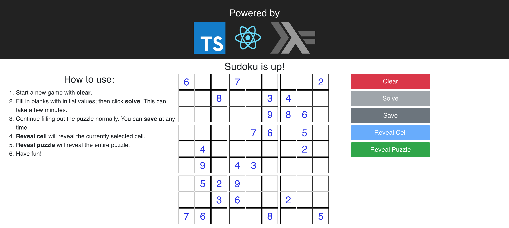

# Sudoku

This is a simple web app for solving sudoku puzzles.

## Prerequisites

- Postgres
- Stack
- Yarn

## Building

- Create the database with `db/scorch.sh`.
- To build the executable, run `cd backend && stack build`.
- Build the ui with `cd ui && yarn`.

## Running

- To start the server, execute `cd backend && stack exec sudoku-exe`.
- The UI is started with `cd ui && yarn start`.
- Navigate to `http://localhost:3000/` in your browser and you should see the web page.